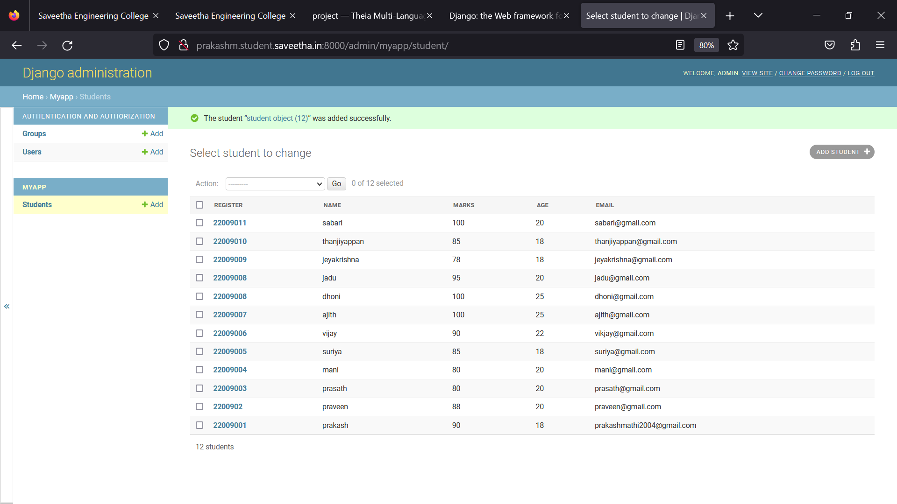

# Ex02 Django ORM Web Application

## AIM
To develop a Django application to store and retrieve data from a student database using Object Relational Mapping(ORM).

## Entity Relationship Diagram

## DESIGN STEPS

### STEP 1:
Clone the problem from github
### STEP 2:
Create a new app
### STEP 3:
Enter the code for admin.py and model.py
### STEP 4:
Execute Django admin and create 10 employees

## PROGRAM
~~~
admin.py

from django.contrib import admin
from.models import student,studentAdmin
admin.site.register(student,studentAdmin)

model.py
from django.db import models

from django.contrib import admin
class student (models.Model):
    register=models.IntegerField()
    name=models.CharField(max_length=100)
    marks=models.IntegerField()
    age=models.IntegerField()
    email=models.EmailField()

class studentAdmin(admin.ModelAdmin):
    list_display=('register','name','marks','age','email')
~~~
## OUTPUT

## RESULT
The program for creating student database using ORM is completed successfully.
